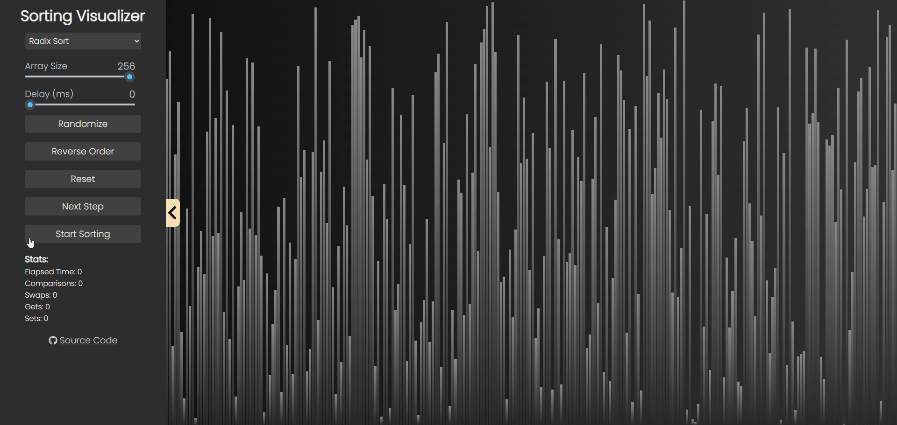

# Sorting Visualizer
## Overview
This is a web application that allows users to visualize various sorting algorithms in action. Users can interact with the app to understand how different sorting algorithms work and observe the step-by-step process of sorting. [Live demo](https://ethmore.github.io/sorting-visualizer/)


## Table of Contents
- [Features](#features)
- [Demo](#demo)
- [Installation](#installation)
- [Usage](#usage)
- [Supported Algorithms](#supported-algorithms)


## Features
- Visualize popular sorting algorithms.
- Step-by-step animation of the sorting process.
- Adjustable speed controls for the visualization.
- Choose array size for sorting.
- Reverse Order for worst case scenarios
- Pausing in the middle of sorting

## Demo 
### Merge Sort

| Bubble Sort | Odd Even Sort |
-|-
|||

| Quick Sort | Radix Sort |
-|-
|||


## Installation
Clone the repository:
```
git clone https://github.com/ethmore/sorting-visualizer
```
Change into the project directory:
```
cd sorting-visualizer
```
Install dependencies:
```
npm install
```


## Usage
Start the application:
```
npm start
```
Open your browser and navigate to http://localhost:3000.

Interact with the app to visualize sorting algorithms.


## Supported Algorithms
- Bubble Sort
- Selection Sort
- Quick Sort
- Insertion Sort
- Shell Sort
- Heap Sort
- Comb Sort
- Gnome SortD
- Cocktail Sort
- Odd Even Sort
- Bogo Sort
- Bucket Sort
- Radix Sort
- Merge Sort
- In-Place Merge Sort
- Binary Insertion Sort
- Tim Sort

Feel free to add more algorithms or customize the existing ones.

## License
This project is licensed under the MIT License.